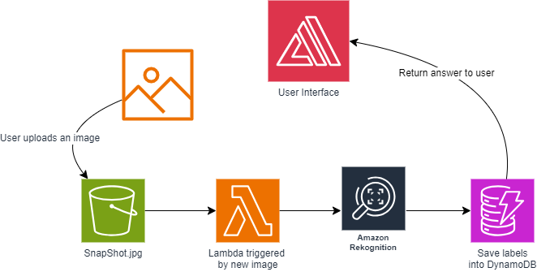

# AWS-rekognition
Take a webcam snapsnot and pass it to AWS Rekognition for machine learning

The user will take a picture with their webcam which will then be passed to AWS Rekognition via a Lambda function. The function will then return the discovered image information to the user. 

